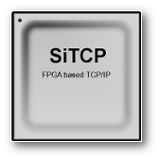

Read this in other languages: [English](README.md), [日本語](README.ja.md)

# SiTCPXG_Sample_Code_for_XEM8320

XEM8320通信確認用のSiTCPXGサンプルソースコードです。

使用方法についてはPDFファイル（XEM8320_SiTCP_XG_EEPROM.pdf）をご確認ください。

## SiTCPXG とは

物理学実験での大容量データ転送を目的としてFPGA（Field Programmable Gate Array）上に実装されたシンプルなTCP/IPであるSiTCPの10GbE専用ライブラリです。

* SiTCP、SiTCPXGについては、[SiTCPライブラリページ](https://www.bbtech.co.jp/products/sitcp-library/)を参照してください。
* その他の関連プロジェクトは、[こちら](https://github.com/BeeBeansTechnologies)を参照してください。

## 履歴

#### 2026-04-09 Ver.1.0.0

* 新規登録。

